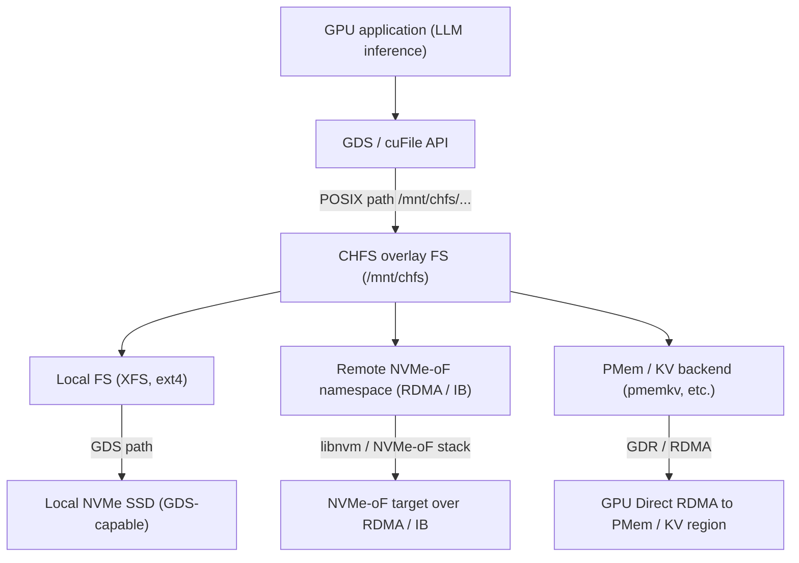
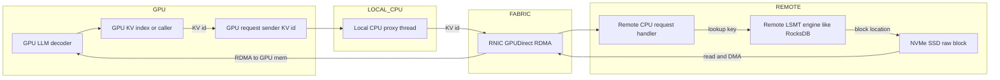

## GDSバックエンドの全体フロー（シーケンス図）

```mermaid

flowchart TD
  A["GPU application (LLM inference)"]
  B["GDS / cuFile API"]

  C["CHFS overlay FS (/mnt/chfs)"]

  C1["Local FS (XFS, ext4)"]
  C2["Remote NVMe-oF namespace (RDMA / IB)"]
  C3["PMem / KV backend (pmemkv, etc.)"]

  D1["Local NVMe SSD (GDS-capable)"]
  D2["NVMe-oF target over RDMA / IB"]
  D3["GPU Direct RDMA to PMem / KV region"]

  A --> B
  B -->|POSIX path /mnt/chfs/...| C

  C --> C1
  C --> C2
  C --> C3

  C1 -->|GDS path| D1
  C2 -->|libnvm / NVMe-oF stack| D2
  C3 -->|GDR / RDMA| D3

```
## 1トークンレベルKV-Cache再利用機構の図
Prefillがめっっっっっちゃ重くて､再利用できる部分は1トークンたりとも再計算したくないし､無駄なパディングとか､共通する部分があるのに別のファイルに乗ってもほしくない場合のKVS
trie木とブロックデバイスごとのconsistent hashingベースで作る

```mermaid
flowchart LR
  subgraph GPU
    GAPP[GPU LLM decoder]
    GLSTM[GPU KV index or caller]
    GREQ[GPU request sender KV id]
  end

  subgraph LOCAL_CPU
    CCTRL[Local CPU proxy thread]
  end

  subgraph FABRIC
    RNIC[RNIC GPUDirect RDMA]
  end

  subgraph REMOTE
    RCPU[Remote CPU request handler]
    RLSM[Remote LSMT engine like RocksDB]
    RNVM[NVMe SSD raw block]
  end

  %% request path
  GAPP --> GLSTM
  GLSTM -->|KV id| GREQ
  GREQ --> CCTRL
  CCTRL -->|KV id| RNIC
  RNIC --> RCPU
  RCPU -->|lookup key| RLSM
  RLSM -->|block location| RNVM

  %% data return path
  RNVM -->|read and DMA| RNIC
  RNIC -->|RDMA to GPU mem| GAPP


```
