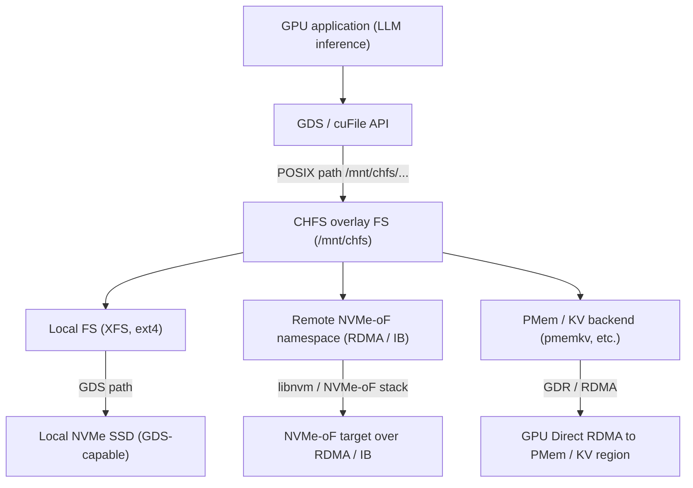
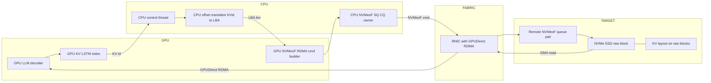

## 1. 全体フロー（シーケンス図）

```mermaid

flowchart TD
  A["GPU application (LLM inference)"]
  B["GDS / cuFile API"]

  C["CHFS overlay FS (/mnt/chfs)"]

  C1["Local FS (XFS, ext4)"]
  C2["Remote NVMe-oF namespace (RDMA / IB)"]
  C3["PMem / KV backend (pmemkv, etc.)"]

  D1["Local NVMe SSD (GDS-capable)"]
  D2["NVMe-oF target over RDMA / IB"]
  D3["GPU Direct RDMA to PMem / KV region"]

  A --> B
  B -->|POSIX path /mnt/chfs/...| C

  C --> C1
  C --> C2
  C --> C3

  C1 -->|GDS path| D1
  C2 -->|libnvm / NVMe-oF stack| D2
  C3 -->|GDR / RDMA| D3

```

```mermaid
flowchart LR
  subgraph GPU
    GAPP[GPU LLM decoder]
    GLSTM[GPU KV LSTM index]
    GENG[GPU NVMeoF RDMA cmd builder]
  end

  subgraph CPU
    CCTRL[CPU control thread]
    COFF[CPU offset translator KVid to LBA]
    CSQ[CPU NVMeoF SQ CQ owner]
  end

  subgraph FABRIC
    RNIC[RNIC with GPUDirect RDMA]
  end

  subgraph TARGET
    QP[Remote NVMeoF queue pair]
    NVME[NVMe SSD raw block]
    LAYOUT[KV layout on raw blocks]
  end

  %% request path
  GAPP --> GLSTM
  GLSTM -->|KV id| CCTRL
  CCTRL --> COFF
  COFF -->|LBA len| GENG
  GENG --> CSQ
  CSQ -->|NVMeoF cmd| RNIC
  RNIC --> QP
  QP --> NVME

  %% data return path
  NVME -->|DMA read| RNIC
  RNIC -->|GPUDirect RDMA| GAPP

  %% layout hint
  NVME --- LAYOUT

```
