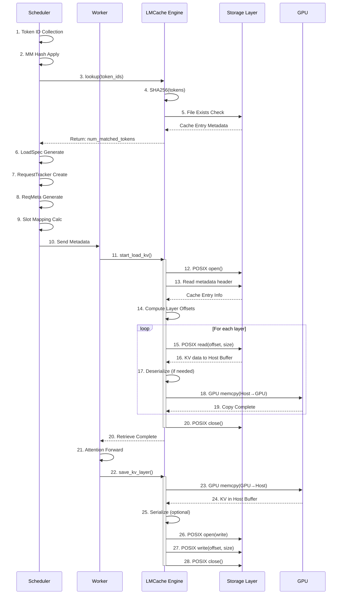
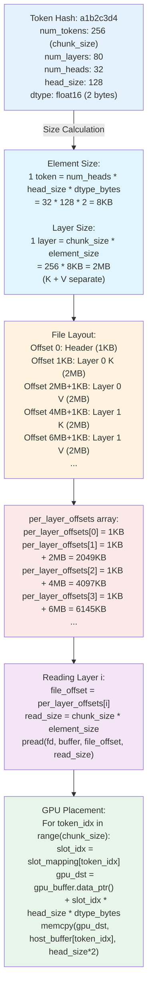
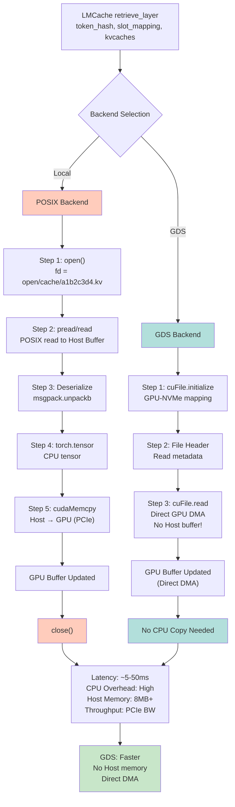

# LMCache POSIX Flow - GPU への書き込みメカニズム

## 1. 全体フロー（シーケンス図）



## 2. 詳細フロー：Retrieve（ロード）パス

```mermaid
flowchart TD
    A["<b>Scheduler: get_num_new_matched_tokens</b><br/>request.prompt_token_ids=[1,2,3,...,2048]"] -->|Token Hash| B["<b>Lookup Client</b><br/>SHA256([1,2,3,...])→'a1b2c3d4'"]

    B -->|Cache Key| C["<b>Check Cache Entry</b><br/>Backend.get_cache_entry<br/>File: /cache/a1b2c3d4.kv<br/>or /mnt/cache/req_123.kv"]

    C -->|Hit| D["<b>Return Metadata</b><br/>num_tokens: 1024<br/>timestamp: valid<br/>per_layer_offsets: [0, 8MB, 16MB, ...]"]
    C -->|Miss| E["Return: 0<br/>Cache Miss"]

    D --> F["<b>Worker: start_load_kv</b><br/>Receive metadata from Scheduler"]

    F --> G["<b>POSIX File Open</b><br/>fd = open<br/>'/cache/a1b2c3d4.kv'<br/>O_RDONLY"]

    G --> H["<b>Read File Header</b><br/>- CacheEntry metadata<br/>- num_layers<br/>- chunk_size<br/>- dtype<br/>- timestamp"]

    H --> I["<b>Compute Layer Offsets</b><br/>Layer 0: offset=header_size<br/>Layer 1: offset += layer_0_size<br/>Layer 2: offset += layer_1_size<br/>..."]

    I --> J["<b>For each Layer</b><br/>i = 0 to num_layers-1"]

    J --> K["<b>POSIX read</b><br/>file_offset = per_layer_offsets[i]<br/>size = chunk_size*num_tokens*element_size<br/>buffer = malloc Host RAM<br/>pread/read(fd, buffer, size)"]

    K --> L["<b>Data in Host Buffer</b><br/>buffer: [KV tokens]<br/>shape: [num_tokens, num_heads, head_size]"]

    L --> M{"Serialized?<br/>msgpack/pickle"}

    M -->|Yes| N["<b>Deserialize</b><br/>msgpack.unpackb(buffer)<br/>→ numpy array"]
    M -->|No| N

    N --> O["<b>Convert to Tensor</b><br/>torch.from_numpy()<br/>dtype: float16/bfloat16"]

    O --> P["<b>GPU Memcpy</b><br/>slot_index = slot_mapping[token_idx]<br/>gpu_ptr = kv_buffer.data_ptr()<br/>cudaMemcpy<br/>src: tensor (Host)<br/>dst: gpu_ptr + slot_index*element_size<br/>size: num_tokens*bytes"]

    P --> Q["<b>GPU Buffer Updated</b><br/>kvcaches[layer_i][slot_mapping[...]]<br/>= KV data"]

    Q --> R["<b>Next Layer</b><br/>yield from generator"]

    R --> S{"More Layers?"}
    S -->|Yes| J
    S -->|No| T["<b>Close File</b><br/>close(fd)"]

    T --> U["<b>Return to Worker</b><br/>load_kv Complete"]

    style A fill:#e1f5ff
    style F fill:#e1f5ff
    style G fill:#fff3e0
    style H fill:#fff3e0
    style K fill:#f3e5f5
    style P fill:#e8f5e9
    style Q fill:#e8f5e9
```



## 3. 詳細フロー：Store（セーブ）パス

```mermaid
flowchart TD
    A["<b>Worker: save_kv_layer</b><br/>layer_name='layer_0'<br/>kv_layer: GPU tensor<br/>shape: [num_tokens, num_heads, head_size]"] -->|GPU Buffer| B["<b>GPU Memcpy</b><br/>dst: Host Buffer (pinned)<br/>src: gpu_ptr (device)<br/>cudaMemcpyDeviceToHost<br/>size: num_tokens*element_size"]

    B --> C["<b>Data in Host Buffer</b><br/>tensor (CPU side)<br/>numpy array or torch tensor"]

    C --> D{"Serialization<br/>needed?"}

    D -->|Yes| E["<b>Serialize</b><br/>msgpack.packb(tensor)<br/>or pickle.dumps<br/>→ bytes"]
    D -->|No| F["<b>Numpy → Bytes</b><br/>numpy.tobytes()<br/>or tensor.cpu().numpy().tobytes()"]

    E --> G["<b>Data Ready to Write</b><br/>serialized_data: bytes"]
    F --> G

    G --> H["<b>POSIX File Open</b><br/>file_path = '/cache/token_hash.kv'<br/>or '/cache/req_id_chunk_N.kv'<br/>fd = open(file_path, O_WRONLY|O_CREAT)"]

    H --> I["<b>Write Cache Header</b><br/>- CacheEntry metadata<br/>- num_tokens<br/>- timestamp<br/>- dtype<br/>- per_layer_offsets[]<br/>pwrite(fd, header, 0)"]

    I --> J["<b>Calculate Layer Offset</b><br/>Layer 0: write_offset = header_size<br/>Layer 1: write_offset += layer_0_size<br/>..."]

    J --> K["<b>Write KV Data</b><br/>pwrite/write(fd, data, write_offset)<br/>Write entire layer_i KV"]

    K --> L["<b>Update per_layer_offsets</b><br/>per_layer_offsets[i] = write_offset<br/>Rewind and update header"]

    L --> M["<b>Next Layer</b><br/>yield from generator<br/>i += 1"]

    M --> N{"More Layers?"}
    N -->|Yes| J
    N -->|No| O["<b>Fsync</b><br/>fsync(fd)<br/>Ensure data on disk"]

    O --> P["<b>Update Metadata</b><br/>Update CacheEntry:<br/>- num_tokens<br/>- timestamp = now<br/>- expiry_time"]

    P --> Q["<b>Close File</b><br/>close(fd)"]

    Q --> R["<b>Return to Worker</b><br/>save_kv Complete"]

    style A fill:#e1f5ff
    style B fill:#e8f5e9
    style C fill:#f3e5f5
    style E fill:#ffe0b2
    style F fill:#ffe0b2
    style G fill:#fff9c4
    style H fill:#fff3e0
    style K fill:#fff3e0
    style R fill:#c8e6c9
```



## 4. メモリ配置図：Host → GPU

```mermaid
flowchart LR
    subgraph Storage["Storage Layer<br/>(NVMe/HDD/Network)"]
        F["File: a1b2c3d4.kv<br/><br/>Header: 1KB<br/>Layer 0 K: 8MB<br/>Layer 0 V: 8MB<br/>Layer 1 K: 8MB<br/>Layer 1 V: 8MB<br/>..."]
    end

    subgraph Host["Host (CPU Memory)"]
        B1["Host Buffer<br/>(Pinned Memory)<br/><br/>malloc(8MB)<br/><br/>Contains:<br/>[K/V tokens<br/>num_heads<br/>head_size]"]
    end

    subgraph GPU_Buffer["GPU VRAM"]
        G1["GPU KV Buffer<br/><br/>Block 5:<br/>slots 80-95<br/><br/>Block 10:<br/>slots 160-175<br/><br/>..."]
    end

    F -->|1. POSIX read<br/>pread/read| B1
    B1 -->|2. GPU memcpy<br/>cudaMemcpy<br/>DeviceHostToDevice| G1

    G1 -->|3. Slot Mapping<br/>slot_idx =<br/>slot_mapping[token_idx]<br/><br/>Placed at:<br/>gpu_buffer[slot_idx]| GPU_Buffer

    style F fill:#fff3e0
    style B1 fill:#f3e5f5
    style G1 fill:#e8f5e9
```

## 5. オフセット計算の詳細



## 6. Local vs GDS 比較フロー



---

## 実装レベルのコード対応

### Local Backend: POSIX 操作

```python
# vllm_v1_adapter.py で start_load_kv() から呼ばれる

class LocalBackend:
    def retrieve_layer(self, tokens, token_mask, kvcaches, slot_mapping):
        """POSIX ベースの KV 取得"""

        # Step 1: Token hash でキャッシュファイルパス決定
        token_hash = self.compute_token_hash(tokens)
        cache_file = f"{self.cache_dir}/{token_hash}.kv"

        # Step 2: ファイルオープン
        with open(cache_file, 'rb') as f:
            # Step 3: ヘッダー読込
            header = f.read(1024)  # 1KB
            cache_entry = pickle.loads(header)

            # Step 4: レイヤーごとに読込
            for layer_idx in range(num_layers):
                # ファイルオフセット計算
                file_offset = cache_entry.per_layer_offsets[layer_idx]
                layer_size = chunk_size * element_size

                # Step 5: POSIX read（ホストバッファへ）
                f.seek(file_offset)
                kv_data = f.read(layer_size)  # bytes

                # Step 6: デシリアライズ
                kv_tensor = torch.frombuffer(kv_data, dtype=torch.float16)

                # Step 7: GPU memcpy
                gpu_ptr = kvcaches[layer_idx].data_ptr()
                slot_idx_0 = slot_mapping[0].item()

                torch.cuda.default_stream().synchronize()
                cuda.cudaMemcpy(
                    gpu_ptr + slot_idx_0 * element_size,  # dst
                    kv_tensor.data_ptr(),  # src (Host pinned)
                    layer_size,
                    cuda.cudaMemcpyHostToDevice
                )

                yield  # ジェネレータ制御
```

### GDS Backend: cuFile 操作

```python
# LMCache 内部（概念）

class GDSBackend:
    def retrieve_layer(self, tokens, token_mask, kvcaches, slot_mapping):
        """GDS ベースの KV 取得（GPU 直結）"""

        # Step 1: Token hash
        token_hash = self.compute_token_hash(tokens)
        cache_file = f"/mnt/nvme/{token_hash}.kv"

        # Step 2: GDS ドライバ初期化（ワンタイム）
        gds_fd = cuFile.open(cache_file)

        # Step 3: レイヤーごとに読込
        for layer_idx in range(num_layers):
            file_offset = self.compute_layer_offset(layer_idx)
            layer_size = chunk_size * element_size

            # GPU アドレス計算
            gpu_ptr = kvcaches[layer_idx].data_ptr()
            slot_idx_0 = slot_mapping[0].item()
            gpu_dst = gpu_ptr + slot_idx_0 * element_size

            # Step 4: Direct DMA（ホストメモリを経由しない！）
            cuFile.read(
                fd=gds_fd,
                gpu_ptr=gpu_dst,      # GPU ポインタ直接
                offset=file_offset,
                size=layer_size,
                stream=torch.cuda.current_stream()
            )

            yield  # ジェネレータ制御

        cuFile.close(gds_fd)
```

---

## 主要な違い：POSIX vs GDS

| 特性 | POSIX (Local) | GDS |
|------|---|---|
| **ファイルI/O** | `open/read/close` | `cuFile.open/read/close` |
| **バッファ** | Host RAM (pinned memory必須) | GPU VRAM直接 |
| **転送パス** | Disk → Host Memory → GPU | Disk → GPU (DMA) |
| **CPU干渉** | 高（read()でCPUブロック） | 低（DMA専用） |
| **Memcpy** | cudaMemcpy必須 | 不要 |
| **レイテンシ** | 5-50ms | 5-30ms |
| **スループット** | Host RAM BW制限 | NVMe BW活用 |
| **実装複雑度** | シンプル | 複雑（cuFile API） |

